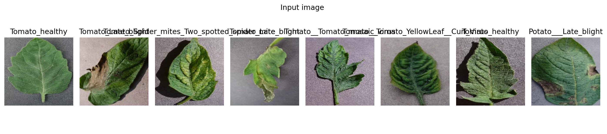
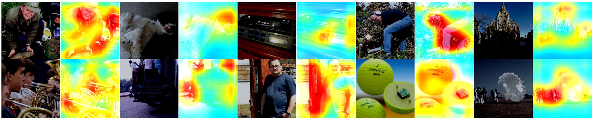

# attention-branch-network

Attention Branch Network（ABN）の実装です。`torchvision.datasets.Imagenette`（10クラス）を用いた画像分類に適用し、モデルがどこを見て予測したかを可視化できます。

## 概要

このプロジェクトは ABN を ResNet 系バックボーン上に実装し、Imagenette データセットでの学習・評価・可視化を行います。学習には Hugging Face `Trainer` を用い、学習率スケジュールやチェックポイント保存を簡潔に扱えるようにしています。

## 主な機能

- **Imagenette 10クラス分類**: 公式の `train/val` 分割をそのまま利用
- **注意機構の可視化**: 注意マップをヒートマップ重畳で保存
- **複数の ResNet 対応**: ResNet18/34/50/101/152
- **Trainer 連携**: 最良モデルの自動保存・読み込みに対応
- **チェックポイント互換**: `model.safetensors` と `checkpoint-XXXX` のどちらからでも可視化可能

## プロジェクト構造

```
attention-branch-network/
├── models/                 # ABN モデル実装
│   └── resnet_abn.py
├── data/                  # データセット（初回実行時に自動ダウンロード）
│   └── Imagenette/
├── checkpoint/            # Trainer 出力（最良モデルや epoch ごとの ckpt）
├── outputs/               # 可視化結果（PNG）
│   ├── abn_attentions.png
│   └── abn_inputs.png
├── train.py               # 学習・評価（HF Trainer）
├── visualize.py           # 注意マップ可視化
├── main.py                # エントリ（サンプル）
├── pyproject.toml         # 依存関係（uv 対応）
└── uv.lock
```

## 動作環境

- Python 3.12 以上
- CUDA 環境（任意。CPU でも動作）

## セットアップ

```bash
# uv を使用（推奨）
uv sync
```

## データセット（Imagenette）

`train.py`/`visualize.py` は初回実行時に Imagenette を自動ダウンロードします。

- 既定の保存先: `./data/Imagenette`
- サイズ指定: `--imagenette-size {full|320px|160px}`（既定: `full`）

## 使い方

### 学習

```bash
uv run train.py
```

- 最良モデルは `--checkpoint` で指定したディレクトリに保存されます（例: `checkpoint/model.safetensors`）。
- 学習途中のチェックポイントは `checkpoint-XXXX/` 形式で保存されます。

#### 評価のみ

```bash
uv run train.py --evaluate --checkpoint checkpoint --gpu-id 0
```

### 可視化（注意マップ）

最良モデル（`checkpoint/model.safetensors`）または任意の `checkpoint-XXXX/` を指定できます。

```bash
# 最良モデルから可視化（既定パス）
uv run visualize.py --ckpt checkpoint/model.safetensors --out-dir outputs --prefix abn

# あるエポックの ckpt を指定
uv run visualize.py --ckpt checkpoint/checkpoint-1924 --out-dir outputs --prefix abn
```

主なオプション（学習/可視化）:

- `--arch {resnet18,resnet34,resnet50,resnet101,resnet152}`（既定: `resnet152`）
- `--imagenette-root`（既定: `./data/Imagenette`）
- `--imagenette-size {full|320px|160px}`
- `-j/--workers` DataLoader ワーカ数（既定: 4）
- `--gpu-id` または `--cpu`（可視化のみ）
- `--checkpoint`（学習の出力先）/`--ckpt`（可視化の入力元）

## 可視化結果

`outputs/` には以下の画像が保存されます。

### 入力画像


### 注意マップ


## 対応アーキテクチャ

- ResNet18
- ResNet34
- ResNet50
- ResNet101
- ResNet152

## 依存関係

- PyTorch / torchvision
- Transformers / Accelerate
- NumPy
- Matplotlib（可視化）
- OpenCV（画像処理）
- safetensors（チェックポイント読込に使用）

## ライセンス

このリポジトリの `LICENSE` を参照してください。

## Acknowledgements

This project includes code from:
"Attention Branch Network: Learning of Attention Mechanism for Visual Explanation"  
by Hiroshi Fukui, Tsubasa Hirakawa, Takayoshi Yamashita, and Hironobu Fujiyoshi,  
licensed under the MIT License.  
Original repository: [https://github.com/machine-perception-robotics-group/attention_branch_network](https://github.com/machine-perception-robotics-group/attention_branch_network)
