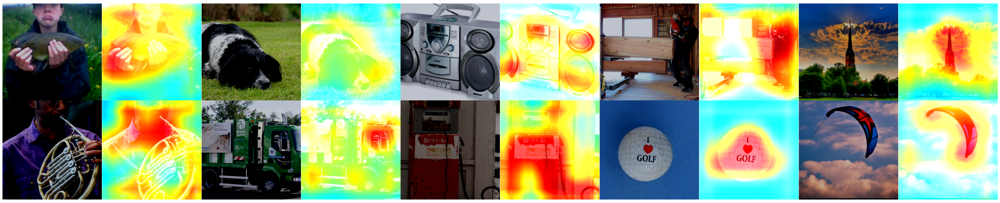

# attention-branch-network

Attention Branch Network（ABN）の実装で、植物病害分類タスクに適用したプロジェクトです。可視化機能により、モデルがどの部分に注目しているかを視覚的に確認できます。

## 概要

このプロジェクトは、PlantVillageデータセットを使用して植物の病害を分類するAttention Branch Networkを実装しています。ABNは、分類タスクと同時に注意機構を学習し、モデルの判断根拠を可視化できるアーキテクチャです。

## 主な機能

- **植物病害分類**: PlantVillageデータセットを使用した多クラス分類
- **注意機構の可視化**: モデルが注目している領域をヒートマップで表示
- **複数のResNetアーキテクチャ対応**: ResNet18, 34, 50, 101, 152
- **可視化スクリプト**: 学習済みモデルから注意マップを生成

## プロジェクト構造

```
attention-branch-network/
├── models/                 # ABNモデル実装
│   └── resnet_abn.py      # ResNetベースのABN実装
├── data/                  # データセット
│   └── PlantVillage/      # PlantVillageデータセット
├── checkpoint/            # 学習済みモデル
├── outputs/              # 可視化結果
│   ├── abn_attentions.png # 注意マップ可視化
│   └── abn_inputs.png     # 入力画像
├── train.py              # 学習スクリプト
├── visualize.py          # 可視化スクリプト
├── main.py               # メインエントリーポイント
└── pyproject.toml         # 依存関係定義
```

## セットアップ

### 依存関係のインストール

```bash
# uvを使用（推奨）
uv sync
```

### データセットの準備

```bash
# PlantVillageデータセットをダウンロード
./download.sh
```

## 使用方法

### 学習

```bash
uv run train.py
```

### 可視化

```bash
uv run visualize.py
```

## 可視化結果

`outputs/`ディレクトリには以下の可視化結果が保存されます：

### 注意マップ可視化

*モデルが注目している領域をヒートマップで表示*

### 入力画像

*元の入力画像*

これらの可視化により、モデルが植物のどの部分に注目して病害を判定しているかを確認できます。

## 対応アーキテクチャ

- ResNet18
- ResNet34  
- ResNet50
- ResNet101
- ResNet152

## 依存関係

- PyTorch
- Transformers
- Matplotlib（可視化用）
- OpenCV（画像処理用）
- NumPy
- Accelerate

## ライセンス

## Acknowledgements

This project includes code from:
"Attention Branch Network: Learning of Attention Mechanism for Visual Explanation"  
by Hiroshi Fukui, Tsubasa Hirakawa, Takayoshi Yamashita, and Hironobu Fujiyoshi,  
licensed under the MIT License.  
Original repository: [https://github.com/machine-perception-robotics-group/attention_branch_network](https://github.com/machine-perception-robotics-group/attention_branch_network)
